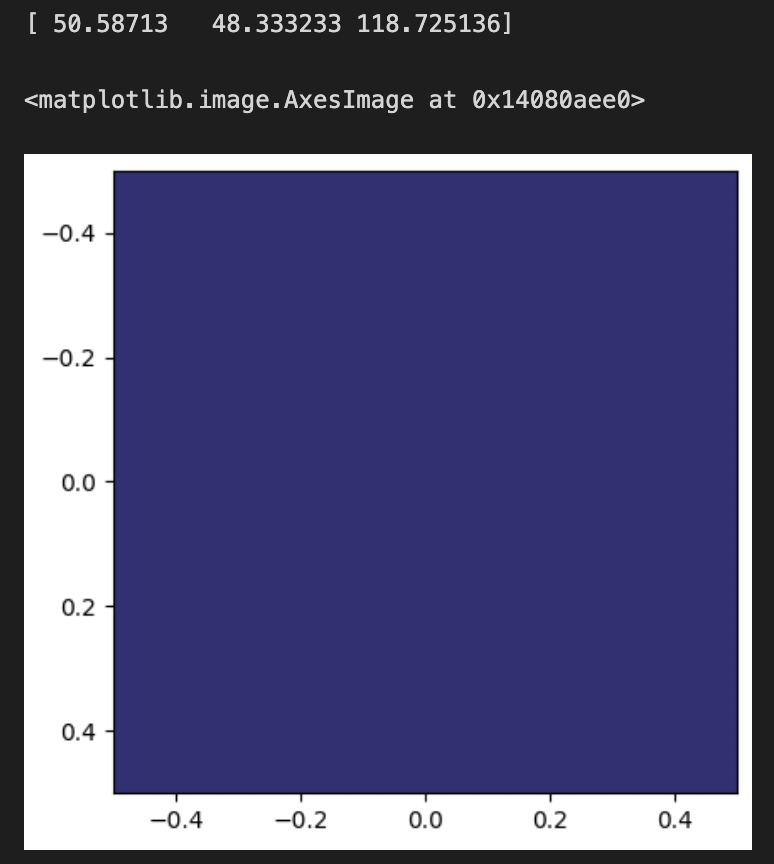

# Word2RGB

This project is inspired by (and trained on) Randall Munroe's [color survey](https://blog.xkcd.com/2010/05/03/color-survey-results/). The survey asked people to name, in free text, random colors sampled from the RGB space. 

One interesting way to look at this data is as a mapping from points in linguistic space to points in RGB space. The code in this repo trains a transformer based model to learn this transformation, treating it as a multioutput regression task.

You can try out an interactive version of the model [here](https://barneymurray.github.io/word2rgb/app/), hosted directly in the browser using [transformers.js](https://huggingface.co/docs/transformers.js/en/index). This version of the model is quantized and converted to ONNX. 

Within python, you can use this model for things like the following:

```python
import torch
from torch import nn
from transformers import DistilBertTokenizer, DistilBertForSequenceClassification
import matplotlib.pyplot as plt
import numpy as np

tokenizer = DistilBertTokenizer.from_pretrained("BarneyMurray0/word2rgb")
model = DistilBertForSequenceClassification.from_pretrained("BarneyMurray0/word2rgb")

def get_rgb_values(input: str):
    inputs = tokenizer(input, return_tensors="pt")

    with torch.no_grad():
        logits = model(**inputs).logits
        s = nn.Sigmoid()
        preds = s(logits).numpy()

    return preds[0]

rgb = get_rgb_values('the night sky')
print(rgb * 255)

plt.imshow([[rgb]])
```



## Local Setup

TODO

